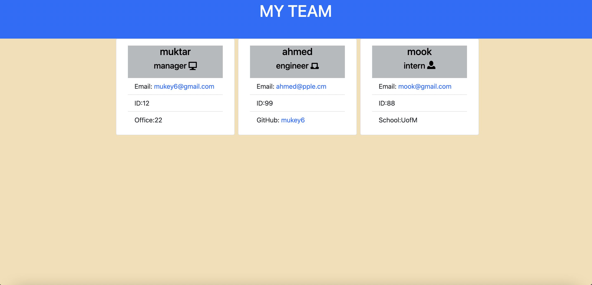

# Team-Profile-Generator  

## Description
   This application allows user to generate basic team member information. Applications prompts user to input team manager information and then about the team member. User can add as many team member as they like. After user is done with team member prompts then an HTML file that is formatted to display the teams information is generated. Generated HTML file will be in the DIST directory
   
## Table of Contents

  - [Installation](#Installation)
  - [Usage](#Usage)
  - [Questions](#Questions)

## Installation
  npm install --save-dev jest to get node module 

## Usage

in the main directory run node index in the terminal to start application. For demo, click [here](https://watch.screencastify.com/v/SEmBPWZCXEAq8wC90Pqm)

## Questions
If you have any Questions, reach me at [Email](mukey6@gmail.com) or [Github](https://github.com/)
    
 
